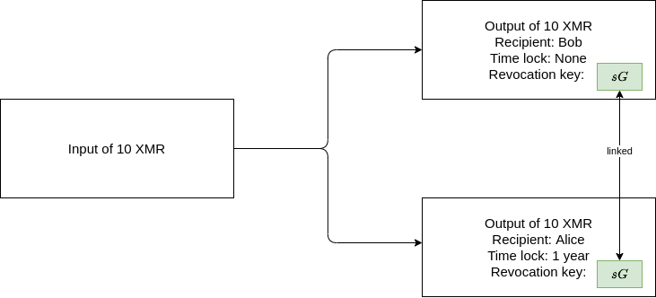

# Revokable branched outputs

## Abstract
While to this day Monero remains one of the top privacy coins in the
cryptocurrency space it still lacks in several aspects, one important aspect
that is drawing a lot of investment and development to other projects are smart
contracts and scripting. While scripting as implemented in Ethereum and Bitcoin
could not easily be implemented in Monero without heavily compromising the
anonymity guarantees that Monero gives its users, increased interoperability or
customizability of the behavior of outputs should nevertheless be sought after.
Furthermore because of this lack of scripting time locked transactions have so
far only had limited utility.

This proposal demonstrates a mechanism by which Monero
transactions could gain more flexibility without compromising anonymity.
These mechanisms would only use already existing cryptographic primitives
that Monero already uses so there would also be a diminished development cost.

## 1 Proposal
### 1.1 Modification to transaction data
* every output requires an additional revocation public key $sG$ ($32$
  additional bytes)
* every input MLSAG ring signature needs to also be signed by the private
  revocation key $s$ leading to the addition of the necessary ring signature
  values $r_{i,3}$ ($32 * m$ additional bytes where $m$ is the amount of ring
  members)
* every input requires a revocation key image $\tilde K_r$ ($32$ additional
  bytes)
* since $\tilde K_r$ key images are unique they themselves can prevent double
spending thus the normal key image $\tilde K$ of the one time address can be
ommited ($32$ bytes less)

### 1.2 Modification to consensus rules
* transactions containing outputs that reuse public revocation keys $sG$ are invalid
* transaction containing inputs that reuse revocation key images $\tilde K_r$ are invalid
* outputs may reuse a revocation key $sG$ if they commit to the same value and
  are part of the same transaction
* Instead of summing all output commitments to verify that no new Monero is
  created just the root output commitments are added.

### 1.3 Modification of transaction construction
* $t_r$ is the root output index, all outputs that share the same revocation
  key $sG$ also share the same $t_r$ output index

#### 1.3.1 Normal outputs
By "normal" outputs single recipient outputs are meant

* revocation public keys are constructed similarly to how one time addresses
  are generated just that additional salt is added to the hash input: $sG = \mathcal
  H_n(rK^v_B, "revocation\_key")G + K^s_B$

#### 1.3.2 Multi-recipient outputs
before creating a multi-recipient output the recipients must perform a
Diffie Hellman key exchange to create a shared private root spend key $k_r^s$.
The different recipients can now derive their private root view key $k_r^v$
and the corresponding public root keys $(K_r^s, K_r^v)$ which they can
distribute to potential senders. Using the public root keys of the
recipients the sender can now compute the necessary values to construct
the outputs:

* public revocation key:
  $sG = \mathcal H_n(rK_r^v, "revocation\_key")G + K_r^s$
* commitment mask:
  $y_{t_r} = \mathcal H_n("commitment\_mask", \mathcal H_n(rK^v_r, t_r))$
* encrypted amount:
  $amount_{t_r} =
  b_{t_r} \oplus_8 \mathcal H_n("amount", \mathcal H_n(rK^v_r, t_r))$

#### 1.3.3 Atomic swaps
Atomic swaps are gone over in detail in section 3.2

## 2 Anonymity
Since all transactions would have to have this additional revocation key and it
would be part of the ring signature the general level of anonymity of transactions
should remain the same.  Furthermore this mechanism would allow the creation of
decoy outputs possibly increasing anonymity. The ability to create more
versatile transaction would likely lead to new heuristics but that is to be
expected.

## 3 Utility
### 3.1 Timelocked inheritance
Let's say Bob owns some XMR but he doesn't trust his daughter so he can't just
give her his keys because she might take his funds while he's alive.
Nevertheless he wants his daughter to have his funds should
anything happen to him. Let's say Bob has a child Alice to which he wants his
10 XMR to go to if he were to be gone for more than a year, so he constructs
a transaction allowing her to claim her output if he does not for a year. Since
this is just a 2 party transaction with him being one of the parties he can
create the secret non-interactively as follows: $s = \mathcal H_n(rK^s_A)$




Now let's imagine Bob wants to use his Monero to pay for a smartphone:


Not only does Bob's spend revoke the time locked output to Alice it also
prevents double spending without requiring the additional key image of
the stealth address $\tilde K$ hence why it can be omitted for space savings.
If Bob didn't spend his Monero for a year because say he unfortunately got hit
by a bus Alice would be free to spend her output after the time lock expires.

### 3.2 Atomic swaps
A similar transaction construction as was just presented could also be used
for atomic swaps, one would just need a smart contract capable of verifying a
public/private EDCSA key pair. As of this writing Bitcoin's scripting language
does not support any opcodes that allow it to do the necessary cryptographic
calculations.  So while directly swapping with Bitcoin might not be possible
at the moment one could likely use an Ethereum smart contract as an
intermediary since they are more flexible. For the purposes of demonstration
the presented scenario will presume that Bitcoin has implemented
a new opcode `OP_CHECK_ED25519_POINT` that takes a private and public EDCSA
key pair and verifies that they belong to each other. In this scenario Bob has Bitcoin
and wants Monero while Alice has Monero and wants Bitcoin.  The price is
already agreed upon. The following diagram visualizes the protocol:

{ width=90% }

{ width=90% }

Since only $d_a$, $sG$ and $Q_a$ are publicly revealed an attacker cannot discover
what amount is being transacted.

### 3.3 Escrow
Just as in the inheritance scenario one can combine this new capability with
multisig wallets to create even more versatile escrow transactions.

## 4 Encoding
Entities which handle a lot of funds may not want the risk of an
intermediary step of converting outputs from standard one address/multisig
outputs to possibly more complex output structures. Therefore they'd likely want
a way for the people who pay them to directly create the desired output
structures but without unnecessary overhead. Therefore a standardized encoding
is proposed:

|data|type/size|
|:----:|:---------:|
|network byte| 1 byte|
|root public spend key|32 bytes|
|root public view key|32 bytes|
|amount of output branches|varint|
|output branches|output branch|
|checksum of entire string of data|4 bytes|

#### output branch

|data|type/size|
|:----:|:---------:|
|time lock: first bit of the encoded value determines whether the value should be interpreted as an absolute time lock or relative to the current block (0: absolute; 1: relative)|varint|
|network byte|1 byte|
|public spend key|32 bytes|
|public view key|32 bytes|

The whole string of bytes would then be encoded into base-58

Here's some example code of how this encoding could be computed:
```python
from sha3 import keccak_256

BASE58_ALPHABET = '123456789ABCDEFGHJKLMNPQRSTUVWXYZabcdefghijkmnopqrstuvwxyz'

data = {
    'root_address': '12281577bd1f0e4a21fa47158a7d6a5b469fe2b25cc89227b5c93bd95f94b2afec9c231992172c10f2d8e3a24d3610a55e2ebe1501c29516b5a5fde1d2e2cea28587fbebcf',
    'branches': [
        {
            'relative': True,
            'timelock': 1100,
            'address': '12281577bd1f0e4a21fa47158a7d6a5b469fe2b25cc89227b5c93bd95f94b2afec9c231992172c10f2d8e3a24d3610a55e2ebe1501c29516b5a5fde1d2e2cea28587fbebcf'
        },
        {
            'relative': False,
            'timelock': None,
            'address': '12fc2b43395408ba60e06409c953e639c64334b33145aa4c9b933a87f658c795372b648fe5dbaaa5d70a3a148ddb1309cfc9a5845fef75b7bc3bba458686585e4b4c536396'
        }
    ]
}

def encode_varint(x):
    data = []
    while x > 0x7f:
        data.append(x & 0x7f | 0x80)
        x >>= 7
    data.append(x & 0x7f)
    return bytes(data)

def b58encode(b: bytes) -> str:
    x = int.from_bytes(b, 'big')
    res = ''
    while x:
        x, dig = divmod(x, 58)
        res += BASE58_ALPHABET[dig]
    return res[::-1] or (b and '1')

 
def serialize_branch(branch):
    as_bin = ('1' if branch['relative'] else '0')\
        + bin(branch['timelock'] or 0)[2:]
    return encode_varint(int(as_bin, 2)) + bytes.fromhex(branch['address'])

def serialize(branches_data):
    buffer = bytes.fromhex(branches_data['root_address'])
    buffer += encode_varint(len(branches_data['branches']))

    for branch in branches_data['branches']:
        buffer += serialize_branch(branch)

    checksum = keccak_256(buffer).digest()[:4]

    return buffer + checksum

def encode_branch_data(branches_data):
    return b58encode(serialize(branches_data))
```

This results in approx. $72 + 72 * m$ bytes where $m$ is the amount of
addresses. For up to a few addresses this can still be stored in a QR-Code.
The OpenAlias standard could be extended to permit another key value field by
default so that one can create more easily remembered aliases for such
transactions.

## 5 Alternative approaches & future improvements

### 5.1 Eliminating interactivity
The current suggested mechanism requires an interactive setup between the
recipients of a multi-recipient branching transaction. While it would be more
favorable if the process were non-interactive it would require a
cryptographic scheme not yet known to the author of this paper
or a compromise to transaction size & privacy. If the sender has knowledge
of $s$ he can determine when an output is spent by watching the blockchain
for the revocation key image $\tilde K_r$.

### 5.1.1 New cryptographic scheme
The creator of a transaction must be able to create the public revocation key
$sG$ from $K_1$, $K_2$, ... $K_n$ such that he cannot retrieve $s$, but anyone
with a private $k_i$ corresponding to one of the public keys used for creation
should be able to retrieve it. If you know of such a scheme feel free to comment
on the corresponding issue [here](https://github.com/monero-project/research-lab/issues/74).

### 5.1.2 Compromise to privacy
The sender could randomly generate $s$ and encrypt it with the individual public
keys of the recipients. This would not only require additional space in
transactions it would also mean that senders have the ability to see when the
outputs they created have been spent.

### 5.2 Pruning of transaction data
With the proposed mechanism where the revocation key is created from a
secret shared by recipients all output branches belonging to the same root
output would have the same commitment, commitment mask, encrypted amount and
revocation key. Each branched output would only have to store the one time address of
the recipient and an optional time lock.

## Conclusion
While the addition of revocation keys would lead to an increase in transaction
size it would allow for more versatile and complex transactions
while preserving privacy. Furthermore all the outputs of
these more complex transactions can be used as decoys in other transactions
assuming that their time locks have expired at the time they are selected as
decoys. The resulting interoperability and flexibility could lead to increased
attention and use likely benefiting Monero and its users overall in the long run.
